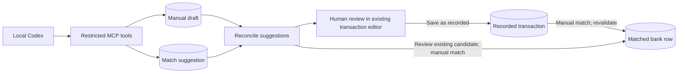

# Local MCP-assisted draft workflow

Status: design revision, 26 September 2026. No MCP implementation has started.
The user rejected a separate proposal inbox and first-class AI/MCP navigation.
The existing Reconcile suggestions area should surface draft transactions and
suggested matches for the selected bank row. A short note can explain a
suggestion; an optional origin badge is visible only while a transaction is a
draft. Ordinary recorded transactions should look ordinary.

## Boundary

```text
Local Codex → restricted MCP endpoint → draft transaction or match suggestion
            → human reviews in Folio → records draft → manually matches bank row
```

The MCP credential may read bounded source facts and submit individual
idempotent suggestions.
It may create manual transactions only with `status=draft`, and may store
suggestions to match existing recorded transactions. It cannot record a draft,
classify a bank row, create a bank match, or void a transaction. The existing
authenticated Folio save action is the approval boundary for a new draft;
the existing match action is the approval boundary for a reconciliation.
Recording and matching are separate actions. A recorded but unmatched
transaction can therefore exist between them. That transaction affects
reports according to ordinary Folio rules, while imported bank rows have no
direct report effect.

This is a change from the earlier proposal-only storage design: an MCP-created
draft is a real Folio transaction, but it is not a recorded financial movement.
Folio already excludes drafts from reports and its exact signed-AUD candidate
query currently includes recorded manual transactions only
([report effects](../src/domain/reports.ts),
[candidate query](../src/database/bank-repository.ts)). Reconcile will need a
separate query for draft suggestions tied to the selected bank row. A draft
must not be silently promoted or matched by an MCP call.

## User-facing workflow

1. The operator provides an invoice or monthly export to Codex. Codex may
   inspect that supplied file, but its extraction remains a suggestion, not
   invoice or tax proof. Codex may also discover artifact metadata and request
   original contents through separately authorised MCP reads.
2. Codex uploads the original file as a typed Folio artifact. Folio validates
   its size, checksum, media type, immutable storage version, and
   profile-specific rules, then places it in the same human-review intake as
   UI uploads. No uploaded artifact becomes usable evidence or imported
   activity merely because upload validation succeeded.
3. Codex submits one suggestion per call, using a caller-supplied idempotency
   key. A new-transaction request creates one manual draft and records its
   intended bank row internally when one exists. Before a CommBank CSV is
   imported, a draft may instead cite its artifact ID and source row number;
   after import, Folio resolves that locator to the resulting bank row and
   presents the draft in Reconcile. This never creates a match. A draft may
   cite an uploaded invoice PDF that is still awaiting review as proposed
   evidence, but this is not an approved attachment. A match-existing request
   stores only the candidate suggestion. The MCP response returns an ID or a
   validation error, not a claim of approval. Bulk submission is deferred.
4. In Banking → Reconcile, the selected row shows its draft or match
   suggestions above the ordinary candidate and manual-action controls. The
   user can open the draft in the existing transaction editor, change fields,
   review proposed invoice PDFs, and save it as recorded only after approving
   any PDF it retains as evidence. The user can then
   return to Reconcile and match it through the existing explicit action.
5. A suggested existing match is never applied automatically. The user opens
   the transaction, reviews it, and performs the ordinary match action.
   Stale bank revisions, an already matched transaction, or a mismatched AUD
   cash effect prevent matching.
6. The user can leave a draft unrecorded or void it. Neither a rejected/voided
   draft nor an unused match suggestion changes a bank row or report totals.

Standalone transaction drafts may appear in Transactions and use its normal
draft-to-recorded workflow. They do not appear in Reconcile without an
explicit intended bank-row link or a verified CommBank artifact-and-row
locator that resolves after import. This preserves bulk transaction creation
without inventing a bank association from amount, date, or description.

## UI boundary

- No top-level Proposals page, proposal inbox, AI/MCP navigation entry, or
  permanent AI/MCP badge on recorded transactions.
- A bank-linked suggestion appears in the existing Reconcile suggestions
  area. A draft may show a temporary, neutral `Suggested draft` badge. The
  user-facing note may say why it was suggested, without being treated as
  authoritative evidence or a security record.
- The same transaction editor is used for human review. Its ordinary `Save as
recorded` action signifies approval of the transaction, not approval of a
  bank match. The match remains explicit.
- Source facts and suggested accounting fields stay distinct. Supplier,
  invoice date, foreign amount, tax treatment, category, and PDF attribution
  inferred from source descriptions or filenames require human review.
- The review UI must preserve clear errors and the selected bank row when a
  save or match fails; it must not advance the queue on failure.



### Reconcile — selected bank row, desktop

```text
Banking / Reconcile
┌─ Bank queue ───────────────┬─ Selected source row ────────────────────────┐
│ 18 Aug  -AUD 49.90         │ Posted 18 Aug · -AUD 49.90 · Unresolved       │
│ 18 Aug  -AUD 1.75          │ Raw description: SUPABASE ... USD 35.19     │
│ ...                       │                                              │
│                           │ Suggested drafts and matches                 │
│                           │ ┌──────────────────────────────────────────┐ │
│                           │ │ Suggested draft · Supplier expense       │ │
│                           │ │ USD 35.19 · AUD 49.90 settlement         │ │
│                           │ │ Note: Check invoice PDF and tax details. │ │
│                           │ │ [Review draft]                            │ │
│                           │ └──────────────────────────────────────────┘ │
│                           │                                              │
│                           │ Recorded transaction candidates              │
│                           │ [Existing candidate] [Review transaction]    │
│                           │                                              │
│                           │ Manual actions: [Create] [Match] [Transfer]  │
└───────────────────────────┴──────────────────────────────────────────────┘
```

`Review draft` opens the existing editor and retains a return path to the
selected bank row. The existing draft editor can provide its normal void
action. After recording, the ordinary candidate and match controls become available.
The source row is never auto-matched by recording the draft.

### Reconcile — narrow screen

```text
☰  Banking / Reconcile
[Bank row selector]
18 Aug · -AUD 49.90 · Unresolved
SUPABASE ... USD 35.19

Suggested drafts and matches
  Suggested draft · Supplier expense
  USD 35.19 · AUD 49.90 settlement
  Note: Check invoice PDF and tax details.
  [Review draft]

Recorded transaction candidates
  [Candidate] [Review transaction]

Manual actions
  [Create transaction] [Match existing] [Mark transfer]
```

The narrow screen preserves full labels and source context without a nested
scroll pane or fixed action footer. A suggestion is not selected or applied
merely because the bank row is selected.

## Internal provenance and idempotency

The user-facing note is editable, so it cannot be the only provenance or
idempotency mechanism. Internal records must retain the submitting credential,
client request key, payload checksum, created draft ID or proposed
existing transaction ID, intended bank row ID and observed revision, and
submission time. Unique constraints prevent duplicate draft creation when
Codex retries. The review UI need not expose these details; a temporary draft
badge and note are sufficient user-facing origin cues.

The minimal internal persistence should be a restricted credential table and
a submission ledger linked to normal draft transactions. Each local MCP
credential is bound to one permitted default transaction owner; Codex cannot
select an arbitrary owner per draft. The human reviewer may change the owner
before recording, subject to ordinary permissions. The transaction model
currently expects a Folio actor and owner. An MCP credential must not
masquerade as the human who later records the draft; the human saver must be
attributable in `updated_by_id` or an equivalent audit field. No transaction
may be recorded without a permitted owner.

A pre-import CommBank locator is the immutable source artifact ID plus source
row number, not an inferred amount/date match. Validate it against the
uploaded CSV's parsed rows before accepting a draft. After human CSV import,
resolve it through the bank-row attribution; if the source file is rejected or
the row is not imported, leave the draft unlinked and visible for manual
review. Never auto-match or silently redirect the suggestion to a similar
bank row.

An idempotency key repeated with an identical canonical request returns the
same draft/suggestion ID; the same key with a different payload conflicts.
Each request has a bounded byte size. A failed request does not leave a
partially created draft or suggestion. A future bulk endpoint can compose
these item-level rules without changing the approval boundary.

## Local transport and authority

The first transport is loopback-only stateless Streamable HTTP with a
proposal-scoped bearer credential. The endpoint keeps no per-client session;
drafts, suggestion links, and idempotency state live in PostgreSQL. It does
not connect callers directly to PostgreSQL or reuse browser cookies. Reject
unexpected `Host` and `Origin` values, authenticate every request, avoid
logging credentials or full financial payloads, and do not route the endpoint
through the public proxy by default. A loopback bind alone is not authority.

The credential is issued/revoked through a local administrator operation,
shown once, stored hashed server-side, and supplied to Codex outside the
repository. It is not a user-facing application destination. Remote exposure,
OAuth, and public credential lifecycle remain later work. The current
2026-07-28 MCP revision changed Streamable HTTP headers and removed protocol
sessions; verify the selected SDK and installed Codex client together before
claiming compatibility ([transport specification](https://modelcontextprotocol.io/specification/2026-07-28/basic/transports/streamable-http),
[TypeScript SDK guidance](https://ts.sdk.modelcontextprotocol.io/v2/migration/support-2026-07-28)).

## Artifact access and upload

The first slice now includes artifact upload and retrieval. This replaces the
earlier existing-artifact-only restriction. File uploads must preserve the
original file and its profile; Codex-extracted values are draft fields, not a
replacement for the source artifact. The first MCP upload/review release
supports only invoice-evidence PDFs, Stripe balance CSVs, and CommBank
transaction-history CSVs. The registry also defines CommBank statement PDFs
and NAB CSVs, but their import workflows are not implemented and MCP must not
accept their uploads yet ([profile registry](../src/artifacts/profiles.ts),
[roadmap](roadmap.md)). Metadata discovery covers all registered profiles,
and original-content reads cover any approved, available artifact regardless
of profile. Original contents are requested separately from metadata because
they may contain personal and financial data.

The existing upload service creates a pending artifact and a short-lived,
checksum-bound storage PUT URL; confirmation verifies object metadata and its
immutable version ([artifact service](../src/documents/service.ts)). A direct
binary upload argument in MCP would inflate large files and couple the server
to the client's filesystem. The proposed contract is therefore
`begin_artifact_upload` → ordinary authenticated PUT to the returned upload URL
→ `confirm_artifact_upload`. This is a stateless workflow; the artifact ID is
the durable hand-off between calls. Confirm must be idempotent or report an
unambiguous already-confirmed outcome after retries. The upload URL is a
temporary write capability, never a read capability.

The existing generic confirmation rejects bank activity profiles, which need
profile-specific import validation. The MCP adapter must not bypass that
boundary. A stored CommBank CSV is not automatically an imported bank row and
a stored Stripe CSV is not automatically a recorded transaction. For a CSV,
confirmation verifies the upload and queues the artifact for per-file preview,
Add to batch or Reject, combined batch review, and human Confirm import in
Sources → Imports. The imported rows or transactions are created only by that
last human action. A malformed CSV remains visibly rejectable. Invoice/evidence
PDFs also await explicit human review before becoming available evidence; PDF
approval creates no transaction. The same state transitions apply to MCP and
UI uploads. A distinct post-upload `awaiting_review` state is the proposed
design; the current `pending` state alone cannot distinguish an incomplete
PUT from a validated file waiting for a reviewer.

Both Stripe and CommBank CSV review must show non-blocking duplicate warnings
for MCP and UI uploads. Warnings should identify the matching artifact or
source rows and why they may overlap: exact same-profile checksum, overlapping
source-row identity, or an exact filename match within the same profile. A
filename match alone is weak evidence and must be labelled accordingly. They
do not replace import-time
duplicate/conflict enforcement: a reviewer may inspect a false-positive
warning, but cannot override a genuine duplicate into a second financial
record.

This requires a durable intake hand-off: the current Stripe and CommBank batch
queues are held in browser component state, so an MCP-created artifact will
not appear in an operator's queue without new persisted review state or a
server-derived review listing. The first slice must add that bridge and let
the existing per-file preview/admission UI open an uploaded artifact by ID.
For CommBank, `pending` currently persists until `confirmBankImport`; for
Stripe, generic confirmation produces `available` before preview. Treating
either artifact state alone as proof of import approval would be incorrect
([CommBank operations](../src/server/bank-operations.ts),
[Stripe import route](../src/routes/-transaction-workflow.tsx)).

`list_artifacts` returns bounded, paginated metadata with ID, profile,
original filename, MIME type, size, checksum, state, and link counts; it never
returns bytes or storage keys. `read_artifact` accepts an artifact ID and
returns the original file with its MIME type and filename under a distinct
read-content scope. The user confirmed that MCP content reads are limited to
approved, `available`, versioned artifacts, matching the current UI download
boundary ([download service](../src/documents/service.ts)); metadata may show
other states. Neither tool exposes
raw object keys or storage credentials. Each content read is authorised and
audited, with a bounded response; the exact MCP binary representation and
Codex handling must be tested before choosing embedded content versus a
resource link. The protocol supports both embedded resources and resource
links, and binary resources use base64
([MCP tools](https://modelcontextprotocol.io/specification/2026-07-28/server/tools),
[MCP resources](https://modelcontextprotocol.io/specification/2026-07-28/server/resources)).

Upload, metadata-read, and content-read are separate credential scopes. A
draft-submit credential must not implicitly grant file access. The user
confirmed that a draft may cite a still-unapproved invoice PDF ID. Store this
as proposed evidence, distinct from the approved transaction-artifact link;
show its review state in the draft editor. Folio must prevent recording while
any retained proposed PDF is not approved and available. On save, revalidate
the artifact state and create the approved evidence link in the same
transaction as promotion to recorded. A rejected PDF cannot be silently
attached; the reviewer may remove it or choose approved evidence. Source CSVs
remain provenance for their own import workflows, not invoice evidence.

## First tools

| Tool                        | Permitted effect                                                     |
| --------------------------- | -------------------------------------------------------------------- |
| `list_unresolved_bank_rows` | Bounded source facts and revision tokens                             |
| `search_transactions`       | Bounded recorded candidate search                                    |
| `list_artifacts`            | Bounded metadata across artifact profiles and states                 |
| `read_artifact`             | Original available artifact content, separate scope                  |
| `begin_artifact_upload`     | Create an upload intent for one of the three supported profiles      |
| `confirm_artifact_upload`   | Verify the uploaded version and queue a supported profile for review |
| `submit_draft_transaction`  | Create one manual draft only                                         |
| `suggest_existing_match`    | Store one existing-match suggestion only                             |
| `get_submission_status`     | Read one own submission outcome and linked ID                        |

No tool can record, approve, match, classify, delete, run raw SQL, or
read arbitrary transactions. Artifact upload cannot import bank rows or
record transactions without a separate human-reviewed workflow. A match
suggestion is a recommendation to use
the existing Folio match action, not an MCP-created reconciliation.

## Verification gates

1. Schema and domain tests: request-size bound, scoped credential, idempotent
   retries, conflicting payload, actor/owner attribution, draft-only writes,
   and no report/bank-state effect before human action.
2. Protocol and security tests: current MCP wire format with Codex, anonymous
   and wrong-scope rejection, unexpected `Host`/`Origin` rejection, and no
   public-proxy exposure. Confirm upload/read isolation, immutable-version
   checks, oversized-file rejection, retry outcomes, private-content access
   controls, and denial of content reads for every non-available state. Test
   against synthetic records; use of real bank
   descriptions requires separate permission under the repository's privacy
   instructions.
3. Artifact-review tests: MCP and UI uploads both remain awaiting review;
   same-profile checksum, source-row overlap, and filename matches show
   reason-labelled warnings; a filename-only match remains non-blocking;
   import-time duplicate/conflict rules still prevent a second financial
   record. A draft may cite an unapproved PDF as proposed evidence, but cannot
   become recorded with that PDF until approval; rejection or deletion cannot
   leave an approved evidence link. Stripe CSVs queue for import but cannot
   spawn parallel MCP draft transactions from their rows. Unsupported NAB CSV
   and CommBank statement PDF upload profiles are rejected in the first slice;
   approved artifacts of either profile remain readable.
4. Reconcile UI tests: draft/match suggestions for the intended bank row only,
   keyboard/narrow-screen review, stale state, edit return path, and no
   implicit save or match.
5. PostgreSQL workflow tests: MCP draft → human edit/record → candidate appears
   → human match; retries do not duplicate drafts, recording does not match,
   and stale or amount-mismatched rows remain unresolved. A pre-import
   CommBank artifact-and-row locator resolves only after import and does not
   match automatically; a rejected or missing row leaves the draft unlinked.
   Credential-bound ownership cannot be changed by Codex and human owner
   changes are attributed to the reviewer.
6. Local end-to-end smoke: submit one synthetic draft and one existing-match
   suggestion, record and match the draft, leave another draft unrecorded,
   and verify the ordinary transaction and bank views.

## Review granularity

The user confirmed individual submission and recording one reviewed draft at
a time for the first slice. The earlier batch-submission and `approve selected`
proposal-inbox actions are deferred. Each draft must be opened and saved as
recorded by a human. Each bank match remains a separate explicit human action.

The user requested retrieval of metadata and original contents for all
artifact profiles, plus artifact upload before draft submission. They
confirmed the two-step upload and that CSV uploads enter the existing
human-reviewed import flow. MCP may read original bytes only for approved,
available artifacts; metadata can cover all states. Drafts may cite an uploaded
but unapproved PDF as proposed evidence; recording remains blocked until
artifact approval. The confirmed duplicate-warning signals are same-profile
checksum, overlapping source rows,
and same-profile filename matches; filename alone does not prove duplication.
Exact MCP binary-result handling and the durable import-queue bridge require
verification against the installed Codex client and current application UI.

Stripe CSV import currently creates recorded transactions. Submitting drafts
for the same Stripe rows and then confirming their import would duplicate
financial movements. The user confirmed that Codex must not submit drafts for
Stripe CSV rows. Codex uploads the original Stripe CSV into human import
review; the existing confirmed import is the sole transaction-creation path
for those rows. CommBank import creates bank activity rows, which may then be
reviewed against separate draft transactions. A draft referencing a Stripe CSV
row is rejected at MCP submission rather than left for the reviewer to spot.
